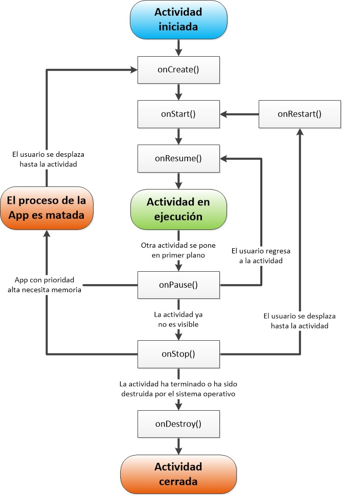

### Ciclo de vida de un activity



### Ejemplo en código:

Estas son las funciones para establecer el ciclo de vida de un activity

```
@Override
    protected void onStart() {
        super.onStart();
        Toast.makeText(this, "OnStart", Toast.LENGTH_SHORT).show();
        // La actividad esta a punto de hacerse visible.
    }

    @Override
    protected void onResume() {
        super.onResume();
        Toast.makeText(this, "OnResume", Toast.LENGTH_SHORT).show();
        // La actividad se ha vuelto visible (ahora se "reanuda").
    }

    @Override
    protected void onPause() {
        super.onPause();
        Toast.makeText(this, "OnPause", Toast.LENGTH_SHORT).show();
        // Enfocarse en otra actividad  (esta actividad esta a punto de ser "detenida").
    }

    @Override
    protected void onStop() {
        super.onStop();
        Toast.makeText(this, "OnStop", Toast.LENGTH_SHORT).show();
        // La actividad ya no es visible (ahora está "detenida")
    }

    protected void onRestart(){
        super.onRestart();
        Toast.makeText(this, "OnRestart", Toast.LENGTH_SHORT).show();
        // La actividad se ha reestablecido
    }

    @Override
    protected void onDestroy() {
        super.onDestroy();
        Toast.makeText(this, "OnDestroy", Toast.LENGTH_SHORT).show();
        // La actividad está a punto de ser destruida.
    }
```